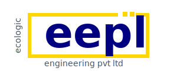

# Ecologic Engineering Pvt. Ltd (EEPL) - Official Website



A modern, responsive website showcasing EEPL's environmental engineering solutions, including ZLD systems, wastewater treatment, and sustainable technologies.

## 🌟 Features

- **Modern UI/UX** - Premium design with glassmorphism effects and smooth animations
- **Responsive Design** - Fully optimized for desktop, tablet, and mobile devices
- **Interactive Components** - Dynamic project modals, filterable portfolios, and contact forms
- **Dark Mode Support** - System-aware theme switching
- **SEO Optimized** - Proper meta tags and semantic HTML
- **Performance Focused** - Optimized assets and efficient code

## 📁 Project Structure

```
Eepl-Website/
├── public/
│   └── assets/           # Images, logos, and media files
├── src/
│   └── input.css         # Tailwind CSS input file
├── docs/                 # Documentation files
├── index.html            # Home page
├── about_us.html         # About Us page
├── services.html         # Services catalog
├── projects.html         # Projects showcase
├── clients.html          # Client testimonials
├── contact_us.html       # Contact form with Formspree
├── carrers.html          # Career opportunities
├── endurance.html        # Endurance project details
├── script.js             # Main JavaScript file
├── style.css             # Additional custom styles
├── tailwind.config.js    # Tailwind CSS configuration
├── postcss.config.js     # PostCSS configuration
├── vite.config.js        # Vite build configuration
└── package.json          # Dependencies and scripts
```

## 🚀 Quick Start

### Prerequisites

- [Node.js](https://nodejs.org/) (v18 or higher)
- npm (comes with Node.js)

### Installation

1. **Clone the repository** (or download the files)
   ```bash
   cd Eepl-Website
   ```

2. **Install dependencies**
   ```bash
   npm install
   ```

3. **Build Tailwind CSS** (Production-ready)
   ```bash
   npm run build:prod
   ```

4. **Start development server** (if using Vite)
   ```bash
   npm run dev
   ```

5. **Preview the site**
   - Open `index.html` in your browser
   - OR use a local server like Live Server extension in VS Code

## 🛠️ Development

### Available Scripts

| Script | Description |
|--------|-------------|
| `npm run build:css` | Build Tailwind CSS (development) |
| `npm run watch:css` | Watch Tailwind CSS for changes |
| `npm run build:prod` | Build optimized CSS for production |
| `npm run dev` | Start Vite development server |
| `npm run build` | Build for production with Vite |
| `npm run preview` | Preview production build |

### Working with Tailwind CSS

The site uses Tailwind CSS for styling. To make changes:

1. **Modify HTML** - Use Tailwind utility classes
2. **Build CSS** - Run `npm run build:prod` before deploying
3. **Custom Styles** - Add to `style.css` for custom CSS

### Adding New Pages

1. Create a new HTML file in the root directory
2. Copy the header/footer structure from existing pages
3. Add navigation links in `script.js` (buildHeaderHtml function)
4. Rebuild CSS if using new Tailwind classes

## 📧 Contact Form Setup

The website uses **Formspree** for contact form submissions.

Current endpoint: `https://formspree.io/f/xojeeevq`

### To use your own Formspree account:

1. Sign up at [Formspree.io](https://formspree.io/)
2. Create a new form
3. Update the form action in `contact_us.html`:
   ```html
   <form id="contactForm" action="YOUR_FORMSPREE_ENDPOINT" method="POST">
   ```

## 🎨 Customization

### Colors

Primary brand colors are defined in Tailwind config and CSS variables:

- **Primary:** Dark Blue (#1e3a8a)
- **Secondary:** Yellow (#FBBF24)
- **Accent:** Green/Teal gradients

### Logo

Replace logo files in `public/assets/`:
- `logo.svg` - Main SVG logo
- `eepl_logo.png` - Fallback PNG logo

### Images

All images are in `public/assets/`. Recommended:
- Compress images before adding
- Use WebP format for better performance
- Add descriptive alt text

## 🌐 Deployment

### Option 1: Netlify (Recommended)

1. **Build production CSS**:
   ```bash
   npm run build:prod
   ```

2. **Push to Git** and connect to Netlify
3. **Build settings**:
   - Build command: `npm run build:prod`
   - Publish directory: `.` (root)

### Option 2: Vercel

1. Import project from Git
2. Configure build command: `npm run build:prod`
3. Deploy

### Option 3: Traditional Hosting

1. Build CSS: `npm run build:prod`
2. Upload all files to server via FTP
3. Point domain to the directory

### Important Deployment Steps

✅ **Before deploying:**
1. Run `npm run build:prod` to generate production CSS
2. Test all pages locally
3. Verify contact form works
4. Check all images load
5. Test on mobile devices
6. Verify all links work

## 📱 Browser Support

- ✅ Chrome (latest)
- ✅ Firefox (latest)
- ✅ Safari (latest)
- ✅ Edge (latest)
- ✅ Mobile browsers

## 🔒 Security

- HTTPS recommended for production
- Formspree handles form security
- No sensitive data stored client-side
- Regular dependency updates recommended

## 📊 Performance

### Optimization Tips

1. **Images**: Compress and use WebP format
2. **CSS**: Already minified with `build:prod`
3. **Caching**: Configure server headers for static assets
4. **CDN**: Consider using a CDN for assets

### Performance Checklist

- [x] Minified CSS
- [x] Optimized images
- [x] Lazy loading for off-screen content
- [x] Efficient JavaScript
- [x] Proper HTML semantics

## 🐛 Troubleshooting

### CSS Not Updating

1. Run: `npm run build:prod`
2. Clear browser cache (Ctrl+F5)
3. Check `public/output.css` exists

### Contact Form Not Working

1. Verify Formspree endpoint is correct
2. Check browser console for errors
3. Ensure JavaScript is enabled

### Images Not Loading

1. Check file paths are correct
2. Verify images exist in `public/assets/`
3. Check file permissions

## 📝 License

© 2025 Ecologic Engineering Pvt. Ltd. All rights reserved.

## 👥 Support

For technical support or inquiries:
- Email: projects@ecologicengineering.co.in
- Phone: +91-9845669830
- Location: Bangalore, Karnataka, India

## 🔄 Version History

### v1.0.0 (January 2026)
- Initial release
- Modern responsive design
- Contact form integration
- Project portfolio
- Client testimonials
- Career listings

---

**Built with ❤️ for a sustainable future**
